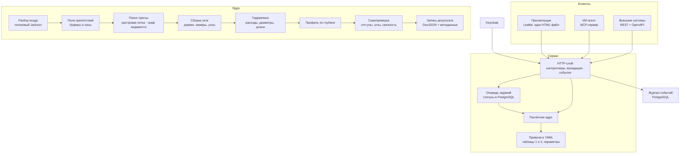

# Архитектура

## Цель

Принять один GeoJSON с существующей сетью, точками присоединения перспективных объектов и городскими
ограничениями — и вернуть до трёх содержательно разных вариантов подключения с маршрутами, местами
присоединения, камерами, диаметрами, стоимостью и ранжированием. Всё остальное подчинено двум
свойствам: результат должен быть **проверяемым** (любое число можно объяснить и пересчитать) и
**воспроизводимым** (тот же вход даёт тот же выход).

## Слои

**Расчётное ядро не знает о HTTP.** Один и тот же код вызывается из синхронного метода, из очереди
заданий и из тестов — поэтому тесты проверяют ровно то, что работает в бою, а не его копию.

**Состояние — в PostgreSQL.** Задания, их статусы, результаты и журнал событий переживают
перезапуск: расчёт файла на гигабайты можно поставить в очередь и забрать позже.

**Нормативная часть — в YAML.** Таблицы 1 и 2 приложения, параметры трассировки и профили для
других ресурсов лежат в `src/main/resources/rules` и перечитываются по `POST /api/rules/reload`.
Новая редакция свода правил меняет конфигурацию, а не код.

## Пакеты

| Пакет | Ответственность |
|---|---|
| `api` | HTTP: расчёт, очередь заданий, правила, образцы, схема результата, последний расчёт, события |
| `ingest` | потоковый разбор входного GeoJSON, определение области расчёта для больших файлов |
| `geo` | перепроекция WGS 84 ↔ EPSG:32637, геометрические утилиты |
| `config` | правила из YAML: справочник диаметров, ограничения, параметры трассировки |
| `planner` | поле препятствий, выбор выхода из здания, стратегии вариантов, сборка сети, самопроверка |
| `routing` | два метода поиска: A\* по растровой сетке и Дейкстра по графу видимости, упрощение пути |
| `network` | топология существующей сети: ориентация к источнику, примыкания камер, цепочки |
| `hydraulics` | расходы по дереву, подбор диаметров, предельная длина, стоимость, влияние на существующую сеть |
| `depth` | дополнительная задача: выбор прохода над или под коммуникацией, профиль, Kгл |
| `export` | запись результата и входных объектов области расчёта, метаданные прослеживаемости |
| `jobs` | очередь заданий, хранение результатов, последний расчёт |
| `events` | журнал событий со сквозным идентификатором запроса |
| `security` | режимы доступа: выключен, необязательный, обязательный |

## Поток расчёта

1. **Разбор входа.** Jackson читает файл потоком: объекты разбираются по одному, файл целиком
   в память не попадает. Для больших файлов сначала идёт быстрый проход, который определяет область
   расчёта по точкам присоединения и существующей сети, — дальше в память попадают только объекты
   этой области. Ошибки данных становятся диагностикой, а не падением.
2. **Проекция.** Геометрия переводится в EPSG:32637: расстояния, буферы и длины считаются в метрах.
3. **Топология существующей сети.** Восстанавливается направление к источнику (по атрибуту, а при
   его отсутствии — по геометрии), считаются примыкания к камерам.
4. **Поле препятствий.** По таблице 2 строятся запретные зоны с отступом по диаметру и зоны
   специальных проходов с осью и минимальным углом пересечения.
5. **Поиск трассы.** Определяется преобладающий азимут застройки, в повёрнутой системе координат
   ищется путь от каждой точки присоединения — по растровой сетке либо по графу видимости.
   Повороты круче 90° не порождаются ни поиском, ни упрощением.
6. **Сборка сети.** Пути сводятся в дерево: близкие точки образуют общий ствол, дальние
   присоединяются через камеры. Выбирается место присоединения: существующая камера, если она рядом
   и у неё есть свободные лучи, иначе новая камера на участке сети.
7. **Гидравлика.** Расходы собираются по дереву, подбираются диаметры, проверяется предельная длина
   непрерывного участка одного диаметра по каждому пути, ставятся камеры и технические узлы.
8. **Глубина** (в режиме дополнительной задачи): пересечения с коммуникациями, выбор прохода сверху
   или снизу по стоимости, профиль со спуском и полкой, коэффициент Kгл.
9. **Самопроверка.** Готовый вариант проверяется по фактическим диаметрам: отступы, повороты,
   пересечения новых участков вне узлов, вертикальные просветы. Нарушения попадают в диагностику,
   а вариант с ними не идёт в выдачу, пока есть чистая альтернатива.
10. **Запись результата.** GeoJSON по разделу 7 плюс блок `metadata` с SHA-256 входного файла,
    редакцией правил и временем расчёта.

## Инварианты

Эти свойства проверяются тестами и независимым валидатором, их нарушение считается дефектом:

* все точки присоединения либо подключены, либо перечислены в `unconnected_oks_ids` с причиной;
* новая сеть — дерево: без колец и без пересечений вне узлов;
* поворотов круче 90° внутри участка нет;
* отступы от чужих объектов выдержаны по фактическому диаметру участка, а не по оценочному;
* ветвление только в тепловой камере, к камере примыкает не более четырёх участков;
* диаметр покрывает расход по таблице 1, предельная длина проверена по каждому пути;
* стоимость и показатель S пересчитываются из геометрии и совпадают с выданными;
* один и тот же вход даёт один и тот же выход.

## Принятые решения

Коротко о том, почему сделано так, а не иначе, — в [adr/](adr/).

## Точки расширения

| Что | Как |
|---|---|
| Другой ресурс (водопровод, кабель) | профиль правил в `rules-profiles/`: свой справочник диаметров и ограничений, код не меняется |
| Новая редакция норматива | правка YAML и `POST /api/rules/reload` |
| Другой метод поиска | реализация в `routing`, выбор параметром `methods` |
| Интеграция с внешней системой | REST с OpenAPI; для ИИ-агента — MCP-сервер в `mcp/` |
